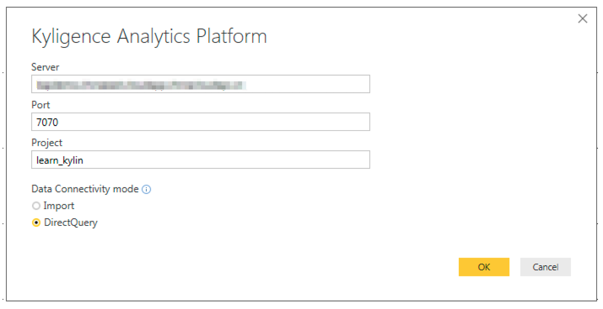
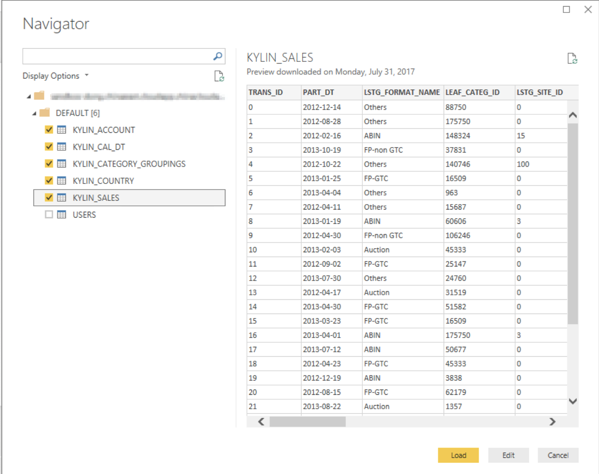

## 与 Power BI Desktop 集成

Microsoft Power BI Desktop 是由微软推出的一款商业智能的专业分析工具，为用户提供简单而丰富的数据可视化及分析功能。

### 安装 Kyligence ODBC 驱动程序
有关安装信息，参考页面 [Kyligence ODBC 驱动程序教程](../driver/kyligence-odbc.cn.md)。

### 安装 Power BI DirectQuery 插件

1. 在 [Kyligence Account 页面](http://account.kyligence.io)下载 KAP Power BI DirectQuery 插件。

2. 将 DirectQuery 插件文件（.mez 文件）复制到 *C:\Users\<user_name>\Documents\Microsoft Power BI Desktop\Custom Connectors* 文件夹，如果没有 *Custom Connectors* 这个文件夹，可以手动创建一个；

3. 打开 Power BI Desktop 中 **Options and settings** 下的 **Options**；

4. 在 **Preview Features** 中勾选 **Custom data connectors**：

 

5. 重启 Power BI Desktop。

### 使用 Power BI Desktop 连接 KAP

1.  启动已经安装的 Power BI Desktop，单击 **Get data -> more**，在 **Database** 类别下选中 **Kyligence Analytics Platform**。
    

2.  在连接字符串文本框中输入所需的数据库信息。请选择 **DirectQuery** 作为数据连接方式。
      

3.  输入账号密码进行身份验证。
      

4.  这样 Power BI 会列出项目中所有的表，可以根据需要选择要连接的表。
      

5.  现在可以进一步使用 Power BI 进行可视化分析，首先对需要连接的表进行建模。
      

6.  现在可以回到报表页面开始可视化分析。
      
